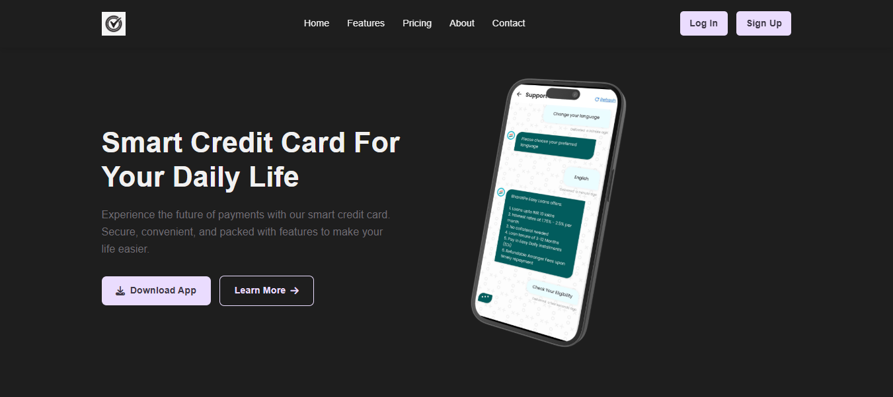

# 💳 Smart Credit Card - Payment Landing Page

A modern, responsive landing page for a Smart Credit Card application, featuring sleek UI, mobile-friendly design, and smooth animations.

---

## 🚀 Features

- ✅ **Fully Responsive** – Works flawlessly on desktop, tablet, and mobile devices
- 🎨 **Modern UI** – Clean layout with attractive colors and subtle animations
- 📱 **Mobile-Friendly Navigation** – Hamburger menu for small screens
- 🔒 **Interactive Elements** – Hover effects on cards, buttons, and links
- 📥 **Clear CTAs** – Download App and Sign Up buttons for user conversion

---

## 🎨 Color Scheme

| Element              | Color Code  |
|----------------------|-------------|
| Hero Background      | `#1e1e1e`   |
| Hero Heading (h1)    | `#f1f1f1`   |
| Hero Text (p)        | `#6f6c73`   |
| Button Background    | `#eadcfe`   |
| Button Text          | `#3d3746`   |
| Primary Accent       | `#7c4dff`   |

---

## 🛠 Technologies Used

- **HTML5** – Structure of the page  
- **CSS3** – Styling and animations  
- **JavaScript** – Interactive behavior (mobile menu, scroll effects)  
- **Font Awesome** – Icons  

---

## 📁 Project Structure

📂 payment-landing-page/
├── 📄 index.html # Main HTML file
├── 📄 styles.css # CSS styles
└── 📄 script.js # JavaScript functionality

---

## 📱 Responsive Breakpoints

| Device   | Width Range     |
|----------|-----------------|
| Desktop  | ≥ 992px         |
| Tablet   | 768px – 991px   |
| Mobile   | ≤ 767px         |

---

## ▶ How to Run

1. Download or clone the project.
2. Open `index.html` in your web browser.
3. Resize your browser to see the responsive layout in action.

---

## 📸 Preview

---

## 📬 Contact

Made with ❤️ by [Md Farhan Alam](https://github.com/mfarhanalam)

---

